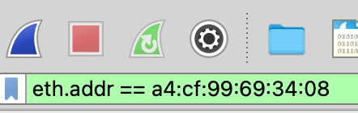

# Instructions

Have you ever wondered what is being sent and transmitted over the network when you use your computer? [Wireshark](https://www.wireshark.org/) is a free and open source packet analysis tool that allows you to view the information received by a network interface at various levels. In this activity, you will use Wireshark to capture and visualize the structure of Ethernet data frames. 

Select your WiFi interface when you start wireshark. 


Then, let it capture frames for at least 30s. As frames are being captured, access MSU Denver's website to generate web traffic. Click on the red stop button to stop the capture session. 


Open a terminal and use the following command to figure out your interface's addresses. For example, if your WiFi interface is **en0** you would run:

```
ifconfig en0
```

My output for **ifconfig** was: 

```
en0: flags=8863<UP,BROADCAST,SMART,RUNNING,SIMPLEX,MULTICAST> mtu 1500
	options=6463<RXCSUM,TXCSUM,TSO4,TSO6,CHANNEL_IO,PARTIAL_CSUM,ZEROINVERT_CSUM>
	ether a4:cf:99:69:34:08 
	inet6 fe80::1c26:35e9:34a5:630b%en0 prefixlen 64 secured scopeid 0xb 
	inet 10.50.26.24 netmask 0xffffff00 broadcast 10.50.26.255
	nd6 options=201<PERFORMNUD,DAD>
	media: autoselect
	status: active
```

On Windows you should probably use the following command instead: 

```
ipconfig eth0
```

Now use wireshark display filter using the following syntax to filter the frames that were originated (or destinated) to (or from) my computer. For example, my MAC address is **a4:cf:99:69:34:08** so I used the following display filter: 



Look at the **Source** and **Destination** IP addresses of the frames. Do they match your interface's IP address? 

Next, select one of the frames and use wireshark's interface to inspect the frame. For example: 


Answer the following questions: 

* what's the length of the frame? 
* what's the type of the frame? 
* what's the frame's source MAC address? 
* What's the frame's destination MAC address? 

Some frames will be broadcast to all computers in the (physical) network. Those frames will use **ff:ff:ff:ff:ff:ff** as the destination MAC address. Use wireshark's display filter to show broadcast frames. Then answer the following questions: 

* What was the name(s) of the protocol(s) that was (were) sending broadcast frames?
* Identify the device(s) that was (were) sending broadcast frames. 

We will be using wireshark in future activities to study upper layer protocols. 